# Nova Runtime Architecture

```mermaid
flowchart LR
  subgraph chrome["TB1 · User's Chrome profile"]
    extension["1. MV3 side-panel extension<br/>Toolbar action opens side panel<br/>Configured app URL in chrome.storage.local"]
  end

  subgraph browser["TB2 · Hosted Nova page in the browser"]
    page["2. React chat route and root shell<br/>TanStack Router renders the chat page"]
    widgets["3. Chat controls and rendering<br/>Composer, attachments, Markdown, code highlighting"]
    state["4. useNovaChat<br/>In-memory turns, loading and error state"]
  end

  subgraph vercel["TB3 · Vercel server boundary · Nitro runtime"]
    transport["5. TanStack Start server transport<br/>Server entry dispatches the server-function request"]
    handler["6. sendChatMessage<br/>POST handler validates the conversation with Zod"]
    gemini["7. Gemini server client<br/>Maps turns to Gemini format; reads GEMINI_API_KEY server-side"]
  end

  subgraph google["TB4 · Google-managed external service"]
    api["8. Gemini GenerateContent API<br/>gemini-flash-latest"]
  end

  extension -->|"iframe loads configured HTTPS app URL"| page
  page -->|"renders chat view"| widgets
  widgets -->|"submit message and attachments"| state
  state -->|"chat server-function call"| transport
  transport -->|"dispatch through error and CSRF middleware"| handler
  handler -->|"validated conversation history"| gemini
  gemini -->|"HTTPS generateContent request + API key header"| api

  classDef component fill:#ffffff,stroke:#52665a,stroke-width:1.5px,color:#202521;
  classDef external fill:#f4f7f3,stroke:#718477,stroke-width:1.5px,color:#202521;
  class extension,page,widgets,state,transport,handler,gemini component;
  class api external;
```

## Component Cards

| Component                       | Responsibility and boundary detail                                                                                                                                      |
| ------------------------------- | ----------------------------------------------------------------------------------------------------------------------------------------------------------------------- |
| Chrome side-panel extension     | Manifest V3 service worker opens the panel; options store the user-entered URL in `chrome.storage.local`. The extension embeds the hosted app and does not call Gemini. |
| React chat route and root shell | The page provides the chat view; the root route supplies the document shell, styles, metadata, and React Query provider.                                                |
| Chat controls and rendering     | The composer accepts text and attachments; message components render turns, Markdown, and highlighted code.                                                             |
| `useNovaChat`                   | Holds conversation turns in browser memory and submits the full current history. Chat history is not persisted by the app.                                              |
| TanStack Start server transport | The server entry dispatches incoming requests. Start middleware adds error handling and CSRF protection for server functions.                                           |
| `sendChatMessage`               | Accepts the server-function POST and validates message roles, content, attachment fields, and count limits with Zod before generating a reply.                          |
| Gemini server client            | Reads `GEMINI_API_KEY` from the server environment, sends the validated conversation to Google, and maps the response or upstream errors.                               |
| Google Gemini API               | External AI service called at the `generateContent` endpoint using the configured `gemini-flash-latest` model.                                                          |

The assistant response follows the same request back to `useNovaChat` and is rendered by the chat controls; that return is not drawn as a second edge. There is no database or persistent conversation store in this runtime path.

## External Dependencies

| Dependency            | Use                                                                                                                                                           |
| --------------------- | ------------------------------------------------------------------------------------------------------------------------------------------------------------- |
| Chrome Extension APIs | `chrome.sidePanel`, `chrome.runtime`, and `chrome.storage.local` power panel activation and URL settings.                                                     |
| Vercel + Nitro        | Hosts the app assets and server runtime. `NITRO_PRESET=vercel` selects the deployment target; `GEMINI_API_KEY` belongs in Vercel server environment settings. |
| Google Gemini API     | Generates replies. Conversation content and attached file data are sent to this service.                                                                      |
| Google Fonts          | The root document loads Space Grotesk and DM Sans stylesheets from Google Fonts. This is a presentation dependency, outside the chat request path.            |

## Trust Boundaries

- **TB1 to TB2, extension to hosted page:** The extension stores a configured URL and embeds it. The manifest permits HTTPS frames; Vercel's `frame-ancestors` header permits Chrome extension origins. The current header is broad and should be restricted to the published extension ID when available.
- **TB2 to TB3, browser to server:** User messages and attachments leave the browser in a server-function request. CSRF middleware and Zod input validation are present; the repository does not implement user authentication or application-level rate limiting.
- **TB3 to TB4, server to Google:** The server sends conversation content and any inline attachment data to Google. The Gemini API key is read and used server-side, not bundled into the extension or browser client.

## Source Map

- Extension: `extension/manifest.json`, `extension/background.js`, `extension/sidepanel.js`, `extension/options.js`
- Chat UI and state: `src/routes/index.tsx`, `src/components/chat/`, `src/hooks/use-nova-chat.ts`
- Server path: `src/server.ts`, `src/start.ts`, `src/lib/chat.functions.ts`, `src/lib/gemini.server.ts`
- Deployment and framing policy: `vite.config.ts`, `vercel.json`
